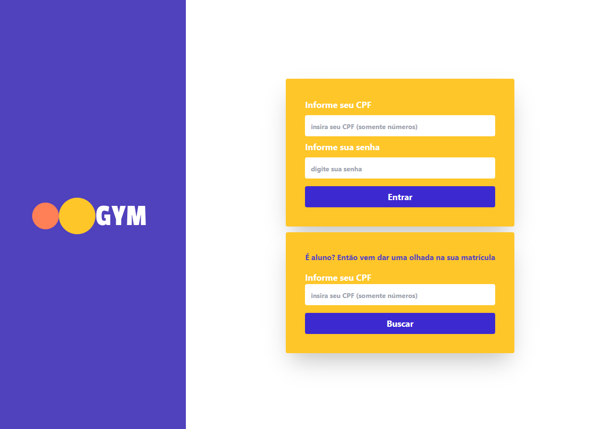
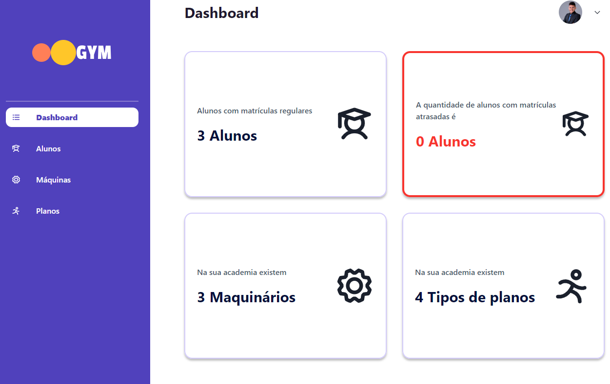
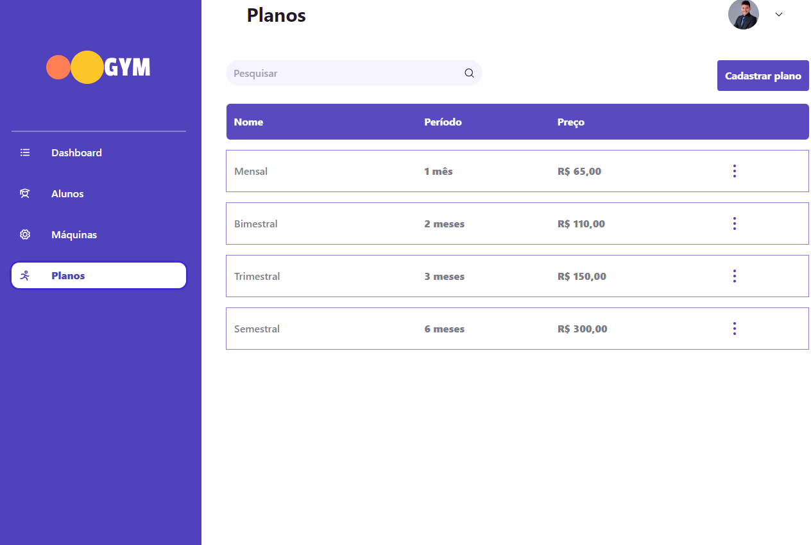

# Gym App Front

## GYM APP

Gym app é um projeto de gerenciamento de uma academia para administrar alunos, máquinas, planos da academia e muito mais. A plataforma é destinada para utilização do administrador da academia ou gerente. O gerente é capaz de criar planos no sistema, tais como inscrição de alunos e maquinários.

A plataforma indica quais usuários estão com planos atrasados e em dia, além disso, mostra quais maquinários precisam de reparos, possibilidade de cadastro de planos diferentes para cada aluno.

## Layouts

Página de login:



Dashboard:



Alunos matriculados:


Maquinarios disponíveis:


Planos disponíveis:



## Como Executar

Clonar este repositório em sua máquina local.

```
Para clonar o repositório utilize git clone [URL_repository]
```

Instalar as dependências do projeto utilizando o comando npm install.

```
Utilizando nodejs e um gerenciador de pacotes yarn.

execute yarn install ou yarn

```

Iniciar o servidor local com o comando npm start.

```
Para executar o projeto, utilize yarn dev.

```

## Documentação técnica

Página de login apresenta uma animação caso você seja gerente ou aluno, sendo necessário as informações dos campos obrigatório.

<aside>
💡 Abaixo é o botão de seleção genérico. Responsável pela interação de seleção caso seja aluno ou gerente.

</aside>

## Tecnologias Envolvidas

```
"dependencies": {
    "@chakra-ui/react": "^2.3.5",
    "@emotion/react": "^11.10.4",
    "@emotion/styled": "^11.10.4",
    "@hookform/resolvers": "^3.0.0",
    "@reduxjs/toolkit": "^1.8.6",
    "@vitejs/plugin-react": "^4.0.0",
    "axios": "^1.0.0",
    "date-fns": "^2.29.3",
    "framer-motion": "^10.0.0",
    "phosphor-react": "^1.4.1",
    "react": "18.2.0",
    "react-dom": "18.2.0",
    "react-hook-form": "^7.43.1",
    "react-input-mask": "^2.0.4",
    "react-redux": "^8.0.4",
    "react-router-dom": "^6.8.1",
    "universal-cookie": "^4.0.4",
    "zod": "^3.21.4"
  },
  "devDependencies": {
    "@rocketseat/eslint-config": "^1.2.0",
    "@testing-library/jest-dom": "^5.16.5",
    "@testing-library/react": "^14.0.0",
    "@testing-library/user-event": "^14.4.3",
    "@types/cookies": "^0.7.7",
    "@types/node": "^18.15.1",
    "@types/react": "^18.0.21",
    "@types/react-dom": "^18.0.10",
    "@types/react-input-mask": "^3.0.1",
    "autoprefixer": "^10.4.12",
    "eslint": "^8.24.0",
    "jest": "^29.5.0",
    "jsdom": "^21.1.1",
    "postcss": "^8.4.17",
    "tailwindcss": "^3.2.7",
    "ts-jest": "^29.0.5",
    "typescript": "^5.0.0",
    "vite": "^4.1.1",
    "vite-plugin-svgr": "^2.4.0",
    "vite-tsconfig-paths": "^4.0.5",
    "vitest": "^0.30.1"
  }

```

# Mais Informações

[Inserir informações adicionais sobre o projeto aqui, se necessário]

OBS: PROJETO EM DESENVOLVIMENTO

